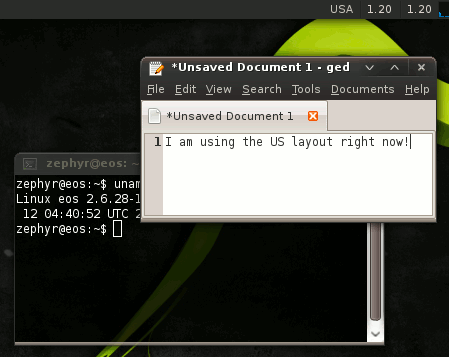
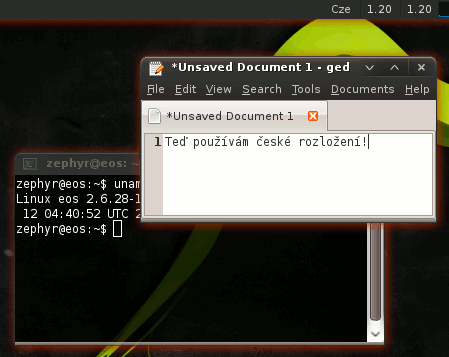

significatio
============

> *significātiō* (Latin) -- indication, sign.

This kludge can do something whenever a certain keyboard group is set. By default, it changes the color of Compiz window shadows. Make changes to `actions.c` if you want a different form of notification.

The number of the keyboard group is specified as the first (and only) argument.

